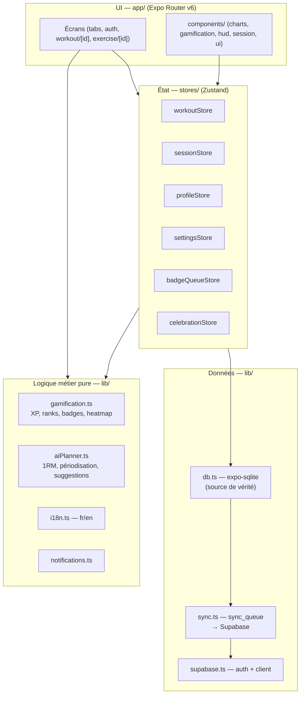

# 00 — Architecture

> Vue d'ensemble technique de GymTrack Mobile. À lire en premier avant toute contribution.

## Vue d'ensemble

GymTrack est une app **offline-first** : SQLite est la source de vérité locale, Supabase est une couche de sync **optionnelle** (l'app fonctionne à 100 % sans compte ni réseau).



## Structure des dossiers

| Dossier | Rôle | Règle |
|---|---|---|
| `app/` | Écrans uniquement (routing file-based Expo Router v6). | Un écran orchestre ; il ne contient pas de logique métier ni de composants réutilisables. ⚠️ Règle violée aujourd'hui par `session.tsx` (1 828 l.) — voir [roadmap](09-ROADMAP-TECHNIQUE.md). |
| `app/(auth)/` | Welcome, login, register + onboarding 21 écrans (flux défini dans `lib/onboardingFlow.ts`). | |
| `app/(tabs)/` | 5 tabs : `index` (home), `session`, `progress`, `planner`, `profile`. | |
| `components/` | Composants réutilisables, rangés **par domaine** (`charts/`, `gamification/`, `session/`, `muscle/`, `onboarding/`, `ui/`). | Un composant utilisé par 2+ écrans DOIT vivre ici. |
| `components/ui/` | Primitives : `Button`, `Card`, `Input`, `Badge`, `StatCard`, `ProgressBar`. | |
| `components/ui/hud/` | **Système HUD canonique** (Skia) : `HudFrame`, `HudCard`, `HudPill`, `BevelButton`, `OctoIcon`, `SegmentedHud`… | ⚠️ `components/hud/` (RankCore, StatsCornerCard, XpRing) est un doublon historique à fusionner — ne pas y ajouter de nouveaux composants. |
| `stores/` | Zustand. Un store = un domaine d'état. | Toute écriture passe par `lib/db.ts` AVANT de mettre à jour le store. |
| `lib/` | Data layer + logique métier **pure** (testable sans React). | Pas d'import React ici (sauf hooks i18n). |
| `types/index.ts` | **Source unique** de tous les types domaine. | Aucun type domaine défini ailleurs. |
| `constants/theme.ts` | Tokens design : `colors`, `spacing`, `radius`, `typography`, `shadows`, `gradients`, `hud`, `rankPalette`, `rarityPalette`, `motion`. | Jamais de hex en dur dans les écrans (voir [standards](02-CODING-STANDARDS.md)). |
| `hooks/` | Hooks partagés (`useBottomNavPadding`). | |
| `assets/` | Images, mascotte, fonts. ⚠️ 56 MB actuellement — à optimiser ([performance](07-PERFORMANCE.md)). | |

## Flux de données

### Écriture (offline-first, systématique)

```
Action UI
  → store.action()                    (ex: workoutStore.addWorkout)
    → lib/db.ts : write SQLite        (saveWorkoutLocal — INSERT OR REPLACE + enqueueSync)
    → set() Zustand                   (UI mise à jour immédiatement)
    → flushSyncQueue().catch(noop)    (arrière-plan, best-effort)
```

**Invariant : SQLite d'abord, store ensuite, sync en arrière-plan.** Jamais l'inverse. Si le write SQLite échoue, le store n'est pas mis à jour.

### Sync Supabase (`lib/sync.ts`)

- Chaque write local ajoute une entrée dans la table `sync_queue` (op `upsert`/`delete`).
- `flushSyncQueue()` draine la queue vers Supabase quand en ligne (test réseau : requête sonde — à remplacer par NetInfo, voir roadmap).
- Au login : `initialSync()` = flush de la queue puis pull complet, **le cloud gagne les conflits**.
- Après onboarding avec compte : `pushAllToCloud()`.
- Tous les appels cloud sont gardés par `isSupabaseConfigured()`.

### Lecture

Les écrans lisent les stores via hooks Zustand avec sélecteurs. Les valeurs dérivées (XP, streak, rank) sont des **fonctions pures** de `lib/gamification.ts` appelées via les sélecteurs du store (`profileStore.getTotalXP()` recalcule depuis `workoutStore`).

## Base de données locale (`lib/db.ts`)

- Tables : `workouts`, `profile` (singleton id=1), `plans`, `goals`, `sync_queue`, `schema_version`.
- Les entités sont stockées en **blobs JSON** dans une colonne `data` — même forme que côté Supabase (colonnes JSONB), ce qui rend le sync trivial.
- **Migrations versionnées** (`SCHEMA_VERSION = 3`), idempotentes (`CREATE TABLE IF NOT EXISTS`). Pour ajouter une table : créer `migrateV4`, incrémenter `SCHEMA_VERSION`, ajouter `if (currentVersion < 4) await migrateV4(db)`.
- Index JSON : `idx_workouts_date` sur `json_extract(data, '$.date')`.

**Décision assumée** : blobs JSON = pas de requêtes relationnelles. Les stats sont calculées en mémoire côté client sur des volumes personnels (quelques centaines de séances max). Si un jour des requêtes analytiques lourdes sont nécessaires, extraire des colonnes matérialisées, pas de refonte du schéma.

## Conventions de nommage

| Élément | Convention | Exemple |
|---|---|---|
| Composants | `PascalCase.tsx`, export nommé | `RestTimer.tsx` → `export function RestTimer` |
| Écrans (routes) | `kebab-case.tsx` ou `[param].tsx` | `body-stats.tsx`, `workout/[id].tsx` |
| Stores | `camelCaseStore.ts`, hook `useXxxStore` | `sessionStore.ts` → `useSessionStore` |
| Lib | `camelCase.ts`, fonctions exportées nommées | `gamification.ts` → `getRankByXP()` |
| Fonctions DB | suffixe `Local` | `saveWorkoutLocal`, `loadPlansLocal` |
| Types | `PascalCase`, dans `types/index.ts` uniquement | `Workout`, `ActiveSession`, `RankTier` |
| Constantes module | `SCREAMING_SNAKE_CASE` | `RANKS`, `BADGES`, `DEFAULT_SETTINGS` |

## Patterns en vigueur

1. **Offline-first write-through** (décrit ci-dessus) — pattern central, ne jamais le contourner.
2. **Logique métier = fonctions pures dans `lib/`** — `gamification.ts` et `aiPlanner.ts` n'importent ni React ni les stores. C'est ce qui les rendra testables ([testing](04-TESTING.md)).
3. **Sélecteurs Zustand fins** — `settingsStore` exporte des hooks dédiés (`useUnits`, `useLanguage`…) pour limiter les re-renders. À généraliser.
4. **Overlays globaux montés dans `_layout.tsx`** — `BadgeUnlockModal`, `CelebrationToast`, `PRCelebration`, `RankUpOverlay` sont pilotés par `badgeQueueStore`/`celebrationStore`, jamais montés dans les écrans.
5. **Haptics uniquement dans `sessionStore`** — les composants ne déclenchent pas de haptique directement (convention CLAUDE.md). ⚠️ Exception existante : `PRCelebration.tsx` — à corriger.
6. **i18n par clés typées** — `t('common.save')`. Le contournement `t(x as any)` pour les clés dynamiques est toléré mais doit passer par un helper unique (voir standards).

## Décisions d'architecture et justifications

| Décision | Justification |
|---|---|
| Expo managed + Expo Router | Solo dev, OTA updates, pas de code natif custom nécessaire. |
| SQLite comme source de vérité (pas AsyncStorage) | Données structurées, volumes croissants, requêtes par date, transactions. |
| Supabase optionnel | Le freemium n'exige pas de compte pour la valeur de base ; réduit la friction d'onboarding. |
| Cloud gagne les conflits | Simplicité. Acceptable car mono-utilisateur mono-device dans le cas nominal. À revoir si multi-device devient un cas réel (last-write-wins par entité serait mieux). |
| Zustand (pas Redux/Jotai) | 6 domaines d'état simples, pas de middleware complexe requis. |
| IA planner **local** (`aiPlanner.ts`) | Zéro coût API, zéro latence, fonctionne offline. Algorithmes : linéaire, 5/3/1, DUP. |
| Deux systèmes de style (NativeWind + `theme.ts`) | NativeWind pour layout/spacing, `theme.ts` pour l'accès programmatique (Skia, Reanimated, heatmap). Complémentaires, pas concurrents. |
| Dark-only (`#080810`) | Choix produit assumé, simplifie tout le theming. |

## Documents liés

- [01-SETUP.md](01-SETUP.md) — installer et lancer le projet
- [02-CODING-STANDARDS.md](02-CODING-STANDARDS.md) — règles de code
- [03-STATE-MANAGEMENT.md](03-STATE-MANAGEMENT.md) — détail des stores
- [09-ROADMAP-TECHNIQUE.md](09-ROADMAP-TECHNIQUE.md) — dette identifiée et priorités
